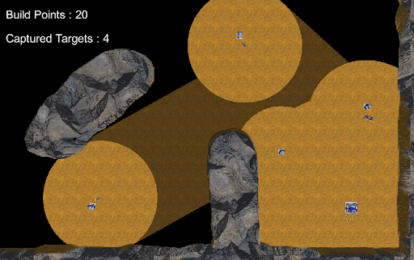
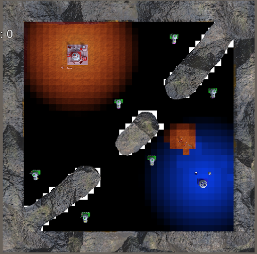

# RTS Project
```
Sami Amara
Guillaume Nisi 
Denis Petit
```

# Features
- Formations
    - Regiment
    - Disk
    - Random
- Individual unit
   - AI (simple state machine)
   - Movement (NavMesh,Steering,Navigation) 

- Global AI
    - Influence Map with compute shader
    - UtilitySystem
    - GOAP
 - Bonus
   - Complete Fog of war with compute shader
  

# Structure

The AI in the game consist of two AI :
    - An utility system
    - A GOAP
  
The utility system defines a global strategy and feed the GOAP with a pre-defines goal 
```
Assets/
    Scripts/
        FogOfWar/
            FogOfWar.cs
            FogOfWar.compute
            FogOfWar.mat
        AI/
            Agent.cs
            Action.cs
            AiController.cs
            WorldState.cs

            Actions /
                Attack.cs
                Capture.cs
                CreateHeavyFactory.cs
                CreateHeavyUnit.cs
                ...

            UtilitySystem/
                Heuristic.cs
                Utility.cs
                UtilitySystem.cs
```

The AI is contained in the AI folder.
Inside the AI folder, at the root we have some of building blocks of the GOAP : 
- Agent.cs
- Action.cs
- WorldState.cs

Inside the Action folder, we have several implementation of the abstract class "Action".
Each one of this actions do one discrete action in the game.

The individual units are drived by a simple state machine

And finaly the "FogOfWar" folder contains the necessary scripts used to create the fog of war (Script, Shaders, Material) 

<div align="center">
    <p></p>
     
     
</div>

# Possible improvemets 
 - The AI is not tuned and thus is kinda dumb
